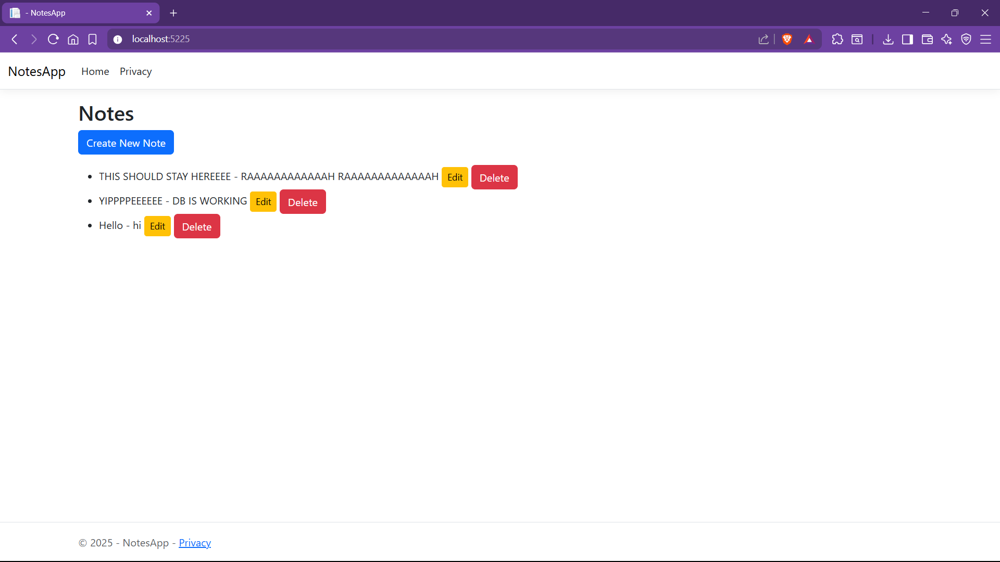
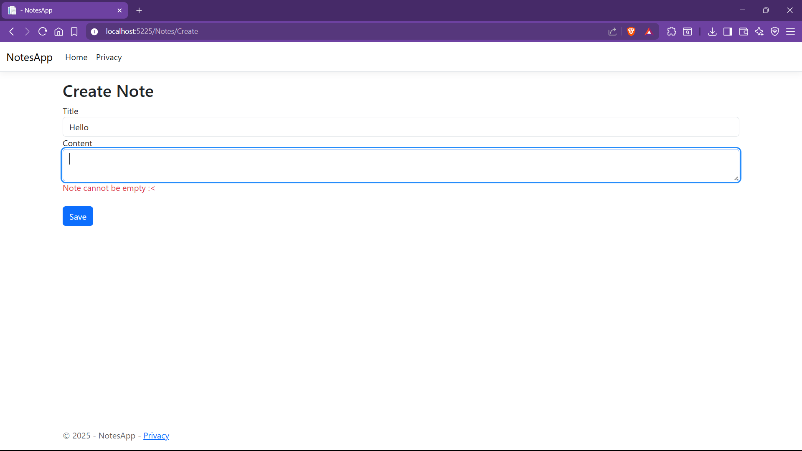
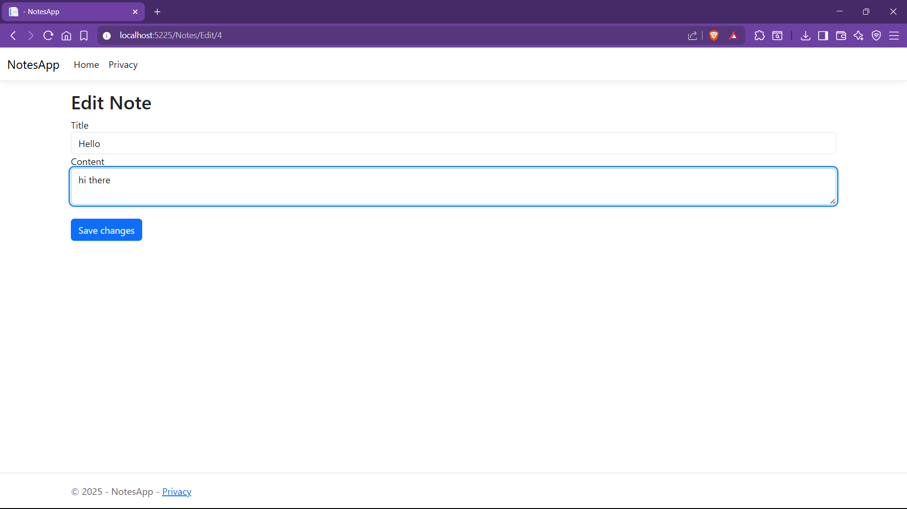

# NotesApp MVC

# 📝 NotesApp MVC

A simple ASP.NET Core MVC web application for managing personal notes.  
Built using Razor views, Entity Framework Core, and SQL Server with full CRUD functionality.

---

## ✨ Features

- Clean MVC architecture with a service layer
- Razor Pages front-end UI
- SQL Server database integration using EF Core
- Add, edit, and delete notes
- Basic form validation and error handling

---

## Features
- MVC pattern
- Razor front-end
- SQL Server via EF Core
- Add, edit, and delete notes
- Service layer abstraction

---

## 📸 Screenshots

### Notes List  
Displays all saved notes with options to edit or delete.



### Create Note  
Add a new note. Form validation is triggered if fields are left empty.



### Edit Note
Edit an existing note.



---

## 🚀 Getting Started

### Prerequisites

- [.NET SDK 8.0+](https://dotnet.microsoft.com/download)
- SQL Server (LocalDB or full version)

### Run Locally

```bash
git clone https://github.com/patrick856/NotesAppMvc.git
cd NotesAppMvc
dotnet build
dotnet ef database update
dotnet run
